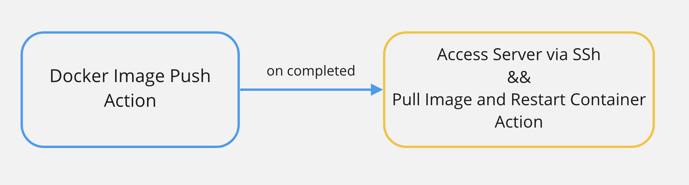

## Deplate

**Deplate**는 개발자를 위한 CI/CD 템플릿입니다. CI/CD를 위해 Github Action 과 Docker Hub를 사용하기로 결정했다면 **Deplate**를 사용해보세요. Github Action 작성에 익숙하지 않거나 사이드 프로젝트를 배포할 때 유용합니다.

<br>

## 필독사항

이 프로젝트를 실행하기전에 아래 사항들을 확인하세요

- 배포에 필요한 서버에 ssh로 접속할 수 있나요?
- Docker Hub 계정이 준비되어 있나요?
- 루트 디렉토리에 Dockerfile이 만들어져 있나요?
- Dockerfile에서 사용할 포트가 ssh서버에서 열려 있나요?

<br>

## 사전설정

이 템플릿은 두개의 workflow로 되어있습니다. 각 workflow에서는 보안을 위해 Github secrets을 참조하고 있습니다. 이 패키지를 실행한 후, 정상적인 동작을 하려면 아래의 Github secrets를 모두 만들어 주셔야 합니다.

<br>

👉 [Github Secret을 설정하는 방법을 모른다면?](https://docs.github.com/en/actions/security-guides/encrypted-secrets)

<br>

| 이름            | 설명                                   | 필요여부 |
| --------------- | -------------------------------------- | -------- |
| DOCKER_USERNAME | Docker Hub 계정의 유저이름             | 필수     |
| DOCKER_TOKEN    | Docker Hub 계정의 토큰 혹은 비밀번호   | 필수     |
| DOCKER_IMAGE    | Docker Hub에 등록된 image 이름         | 필수     |
| DOCKER_PORT     | 배포할 서비스가 사용하는 포트          | 필수     |
| SSH_IP          | ssh를 통해 접속할 서버의 ip 주소       | 필수     |
| SSH_ACCESS_KEY  | ssh를 통해 서버에 접속할 때 필요한 key | 필수     |

<br>

## 설치

이 패키지는 npm을 통한 설치가 필요 없습니다. npx 명령을 사용하세요.

<br>

## 사용법

사용법은 아주 간단합니다! 아래 명령어를 실행합니다.

```shell
npx install @teamapdan/deplate
```

이후 몇가지 질문에 대한 답변을 입력하면, workflow파일이 생성됩니다. 질문 목록은 아래와 같습니다.

- Docker Image를 Docker Hub에 Push하는 workflow에 대한 파일 이름
- Docker Image를 Docker Hub에 Push하는 workflow의 이름

<br>

- Docker Image를 Docker Hub에 Pull하는 workflow에 대한 파일 이름
- Docker Image를 Docker Hub에 Pull하는 workflow의 이름

<br>

파일이름은 아래와 같은 형식이여야 합니다. **push workflow와 pull workflow의 파일이름이 겹치면 안됩니다!**

```shell
filename.yml or filename.yaml
```

## 구조

각 workflow들의 의존성은 아래 그림과 같습니다.



<br>

## Changelog

### 1.1.0

- Docker Hub에 image를 push해주는 workflow 생성
- SSH에 접속해서 docker image를 pull한 뒤, 컨테이너를 재실행 해주는 workflow 생성

### will be soon

- 각 Framework 혹은 Package Manager에 따른 CI workflow 생성
- 각 Framework에 따른 Default Dockerfile 생성
