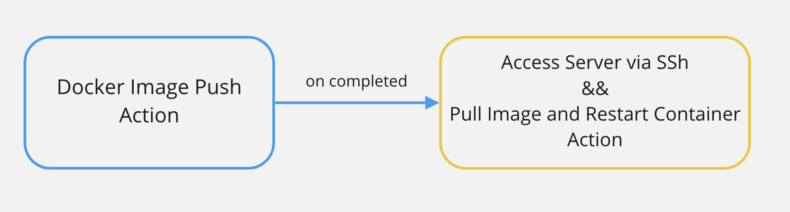

# Deplate

<p align='center'>
  English | <a href='./README.ko.md'>한국어</a>
</p>

**Deplate** is a CI/CD template for developers. If you decide to use GithubAction and DockerHub for CI/CD, try **Deplate**. Useful when you are not familiar with creating GithubAction or when deploying side projects.

<br>

## Must Read

Please check the following before implementing this project

- Can I connect to the server required for deployment through ssh?
- Is the Docker Hub account ready?
- Is Dockerfile created in the root directory?
- Is the port used by Dockerfile open on the ssh server?

<br>

## Preset

This template has two workflows. Each workflow references Github secret for security. After running this package, you must create all of the Github secrets below for normal operation.

<br>

👉 [If you don't know how to set up Github Secret?](https://docs.github.com/en/actions/security-guides/encrypted-secrets)

<br>

| Name            | Description                                      | Required |
| --------------- | ------------------------------------------------ | -------- |
| DOCKER_USERNAME | Username for Docker Hub Account                  | Required |
| DOCKER_TOKEN    | Token or password for Docker Hub account         | Required |
| DOCKER_IMAGE    | Image name registered in Docker Hub              | Required |
| DOCKER_PORT     | Port used by the service to deploy               | Required |
| SSH_IP          | ip address of the server to be connected via ssh | Required |
| SSH_ACCESS_KEY  | Key Required to Connect to Server via ssh        | Required |

<br>

## Installation

This package does not require installation via npm. Use the npx command.

<br>

## Usage

It's very simple to use! Run the command below.

```shell
npx install @teamapdan/deplate
```

If you enter the answers to some of the following questions, a workflow file is created. The list of questions is as follows.

- File name for workflow pushing Docker Image to Docker Hub
- Name of workflow that pushes Docker Image to Docker Hub

<br>

- File name for workflow pulling Docker Image to Docker Hub
- Name of workflow that pulls Docker Image into Docker Hub

<br>

The file name must be in the following format: **The file names of push workflow and pull workflow must not overlap!**

```shell
filename.yml or filename.yaml
```

## Structure

The dependence of each workflow is shown in the figure below.



<br>

## Contributors ✨

Thanks goes to these wonderful people ([emoji key](https://allcontributors.org/docs/en/emoji-key)):

<!-- ALL-CONTRIBUTORS-LIST:START - Do not remove or modify this section -->
<!-- prettier-ignore-start -->
<!-- markdownlint-disable -->
<table>
  <tbody>
    <tr>
      <td align="center" valign="top" width="14.28%"><a href="https://github.com/Skyrich2000"><br /><sub><b>huni</b></sub></a><br /><a href="https://github.com/rkskekzzz/deplate/commits?author=Skyrich2000" title="Code">💻</a> <a href="https://github.com/rkskekzzz/deplate/commits?author=Skyrich2000" title="Documentation">📖</a></td>
    </tr>
  </tbody>
</table>

<!-- markdownlint-restore -->
<!-- prettier-ignore-end -->

<!-- ALL-CONTRIBUTORS-LIST:END -->

This project follows the [all-contributors](https://github.com/all-contributors/all-contributors) specification. Contributions of any kind welcome!

<br>

## will be soon

- Create CI workflow according to each Framework or Package Manager
- Create a Default Dockerfile according to each Framework
